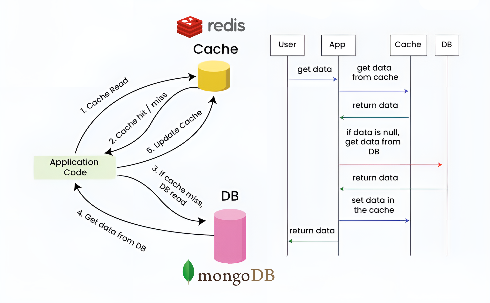
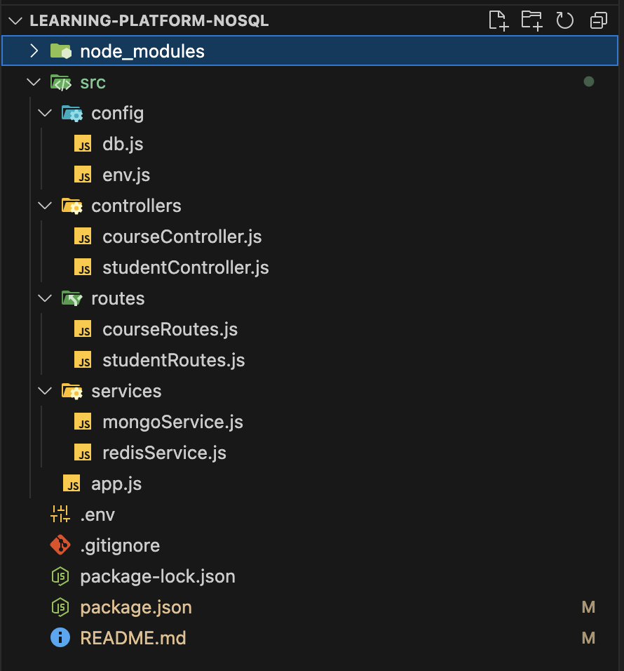
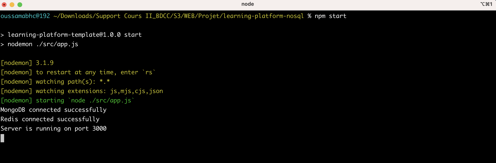
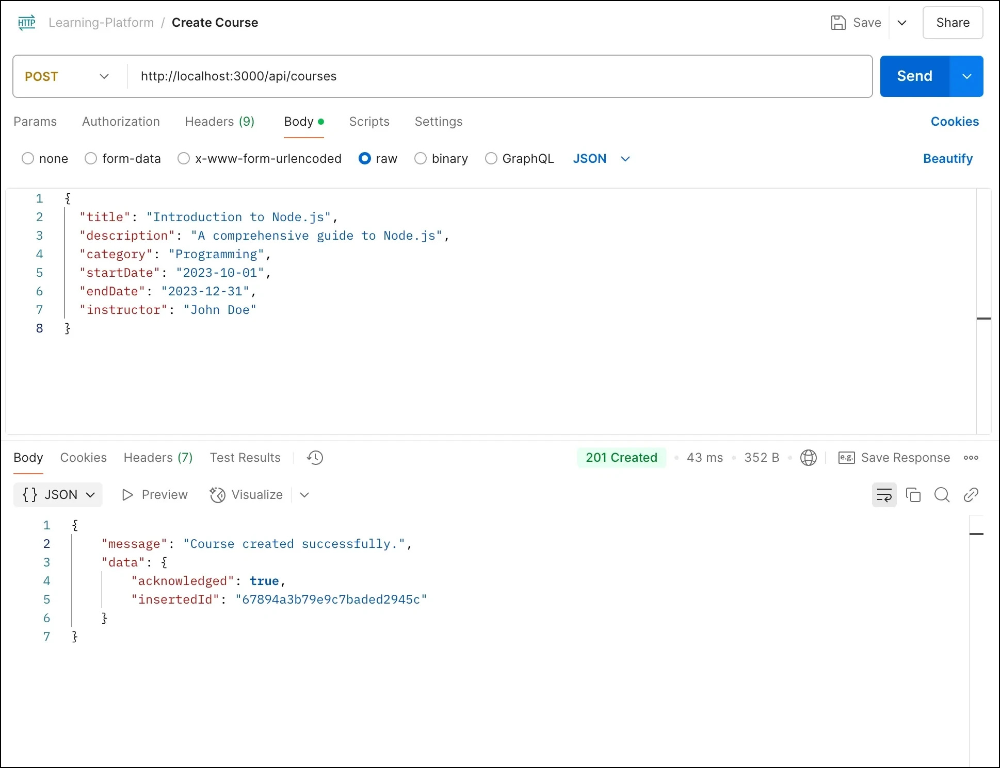
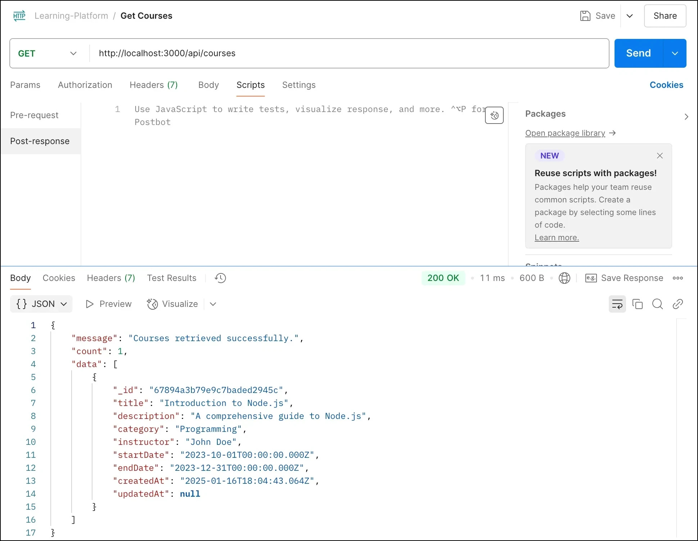
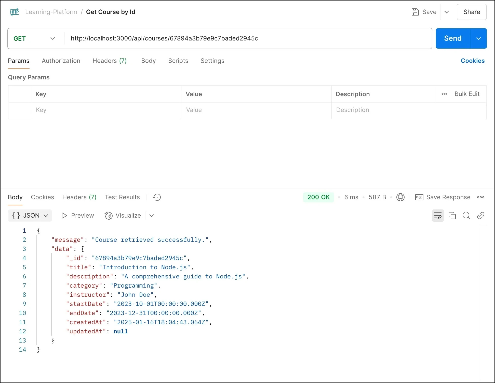

 # Learning Platform NoSQL

## Table des matières

- [Introduction](#introduction)
- [Prérequis](#prérequis)
- [Installation](#installation)
- [Structure du projet](#structure-du-projet)
- [Choix techniques](#choix-techniques)
- [Utilisation](#utilisation)
- [Réflexions et captures d'écran](#réflexions-et-captures-décran)
- [Réponses aux questions des commentaires](#réponses-aux-questions)

## Introduction

Ce projet est une plateforme d'apprentissage en ligne qui utilise une base de données NoSQL (MongoDB) et un cache Redis pour gérer les cours et les étudiants. L'application est construite avec Node.js et Express.js.

## Prérequis

Avant de commencer, assurez-vous d'avoir les éléments suivants installés sur votre machine :

- [Node.js](https://nodejs.org/)
- [MongoDB](https://www.mongodb.com/)
- [Redis](https://redis.io/)
- [Git](https://git-scm.com/)

## Installation

1. **Cloner le dépôt :**
```bash
git clone https://github.com/[votre-compte]/learning-platform-nosql.git
```
2. **Accéder au répertoire du projet :**
```bash
cd learning-platform-nosql
```
3. **Installer les dépendances :**
```bash
npm install
```
4. **Configurer les variables d'environnement :**

Créez un fichier .env à la racine du projet et ajoutez les variables d'environnement nécessaires :
```
MONGODB_URI=mongodb://localhost:27017
MONGODB_DB_NAME=learning_platform
REDIS_URI=redis://localhost:6379
PORT=3000

REDIS_KEY_ALL_COURSES=course\:all
REDIS_KEY_COURSE_PREFIX=course:
REDIS_KEY_COURSE_STATS=stats\:course

REDIS_KEY_ALL_STUDENTS=student\:all
REDIS_KEY_STUDENT_PREFIX=student:
REDIS_KEY_STUDENT_STATS=stats\:student
```
5. **Démarrer le serveur :**
```bash
npm start
```
## Structure du projet
```
learning-platform-nosql/
│
├── README.md
├── package-lock.json
├── package.json
├── node_modules
└── src
    ├── app.js
    ├── config
    │   ├── db.js
    │   └── env.js
    ├── controllers
    │   ├── courseController.js
    │   └── studentController.js
    ├── routes
    │   ├── courseRoutes.js
    │   └── studentRoutes.js
    └── services
        ├── mongoService.js
        └── redisService.js
```
### src/config
* **db.js :** Ce fichier contient les fonctions pour initialiser et gérer les connexions aux bases de données MongoDB et Redis. Il utilise les variables d'environnement définies dans env.js pour se connecter aux bases de données.
* **env.js :** Ce fichier charge les variables d'environnement à partir du fichier .env et les valide pour s'assurer que toutes les informations nécessaires sont présentes.

### src/controllers
* **courseController.js :** Ce fichier contient les contrôleurs pour gérer les opérations CRUD (Create, Read, Update, Delete) pour les cours. Il utilise les services MongoDB et Redis pour interagir avec la base de données et le cache.
* **studentController.js :** Ce fichier contient les contrôleurs pour gérer les opérations CRUD pour les étudiants. Il utilise les services MongoDB et Redis pour interagir avec la base de données et le cache.

### src/routes
* **courseRoutes.js :** Ce fichier définit les routes pour les opérations CRUD sur les cours. Il utilise les contrôleurs définis dans courseController.js pour gérer les requêtes HTTP.
* **studentRoutes.js :** Ce fichier définit les routes pour les opérations CRUD sur les étudiants. Il utilise les contrôleurs définis dans studentController.js pour gérer les requêtes HTTP.

### src/services
* **mongoService.js :** Ce fichier contient les fonctions utilitaires pour interagir avec la base de données MongoDB. Il fournit des fonctions génériques pour les opérations CRUD.
* **redisService.js :** Ce fichier contient les fonctions utilitaires pour interagir avec le cache Redis. Il fournit des fonctions pour mettre en cache et récupérer des données.

### app.js
* **app.js :** Ce fichier est le point d'entrée de l'application. Il configure les connexions aux bases de données, les middlewares Express, monte les routes et démarre le serveur. Il gère également la fermeture propre des connexions aux bases de données lors de l'arrêt du serveur.

## Choix techniques
### Base de données
* **MongoDB :** Choisi pour sa flexibilité et sa capacité à gérer des données non structurées. MongoDB est bien adapté pour les applications nécessitant une grande évolutivité et des performances élevées.
* **Redis :** Utilisé pour le caching afin d'améliorer les performances de l'application en réduisant les temps de réponse pour les requêtes fréquentes.
### Framework
* **Express.js :** Choisi pour sa simplicité et sa flexibilité. Express.js est un framework minimaliste pour Node.js qui permet de créer des applications web et des API de manière rapide et efficace.
### Gestion des connexions
* **Modules séparés :** Les connexions aux bases de données sont gérées dans des modules séparés (db.js et env.js) pour faciliter la maintenance et la réutilisation du code.
### Caching avec Redis
Pour améliorer les performances de notre application, nous utilisons Redis comme cache côté serveur. Voici un schéma décrivant la logique de caching depuis MongoDB avec Redis :


1. **Cache Read :** Lorsque l'application reçoit une requête de données, elle vérifie d'abord si les données sont disponibles dans le cache.
2. **Cache Hit / Miss :** Si les données sont trouvées dans le cache (cache hit), elles sont retournées immédiatement à l'application. Si les données ne sont pas trouvées dans le cache (cache miss), l'application passe à l'étape suivante.
3. **DB Read :** Si les données ne sont pas dans le cache, l'application lit les données directement depuis la base de données MongoDB.
4. **Return Data :** Les données lues depuis la base de données sont retournées à l'application.
5. **Update Cache :** Les données lues depuis la base de données sont mises en cache pour les requêtes futures.

En utilisant cette approche, nous pouvons réduire significativement les temps de réponse pour les requêtes fréquentes et améliorer les performances globales de l'application.

## Utilisation
### Routes disponibles
#### Courses :
* **POST /api/courses :** Créer un nouveau cours.
* **GET /api/courses :** Récupérer tous les cours.
* **GET /api/courses/:id :** Récupérer un cours par son ID.
* **PUT /api/courses/:id :** Mettre à jour un cours par son ID.
* **DELETE /api/courses/:id :** Supprimer un cours par son ID.
* **GET /api/courses/stats :** Récupérer les statistiques des cours.

#### Students :
* **POST /api/students :** Créer un nouvel étudiant.
* **GET /api/students :** Récupérer tous les étudiants.
* **GET /api/students/:id :** Récupérer un étudiant par son ID.
* **PUT /api/students/:id :** Mettre à jour un étudiant par son ID.
* **DELETE /api/students/:id :** Supprimer un étudiant par son ID.
* **GET /api/students/stats :** Récupérer les statistiques des étudiants.

## Réflexions et captures d'écran
### Réflexions
* **Séparation des responsabilités :** En séparant les contrôleurs, les routes et les services, nous avons pu structurer le code de manière modulaire, ce qui facilite la maintenance et la réutilisation du code.
* **Gestion des erreurs :** La gestion des erreurs a été implémentée de manière cohérente pour garantir la robustesse de l'application.
* **Utilisation du cache :** L'utilisation de Redis pour le caching a permis d'améliorer les performances de l'application en réduisant les temps de réponse pour les requêtes fréquentes.

### Captures d'écran
#### Capture d'écran de la structure du projet :


#### Capture d'écran de l'application en cours d'exécution :
  
#### Capture d'écran des tests avec Postman :
 - **Créer un nouveau cours** :
 


 - **Récupérer tous les cours** :



 - **Récupérer un cours par son ID** :



## Réponses aux questions
### .env
1. **Question :** Quelles sont les informations sensibles à ne jamais commiter ?

Les informations sensibles à ne jamais commiter incluent les clés API, les mots de passe, les secrets de connexion à la base de données, et toute autre information qui pourrait être utilisée pour accéder à des systèmes ou des données sensibles.

2. **Question :** Pourquoi utiliser des variables d'environnement ?

Utiliser des variables d'environnement permet de séparer la configuration de l'application du code source, ce qui facilite la gestion des différents environnements (développement, test, production) et améliore la sécurité en évitant de commiter des informations sensibles.

### db.js
1. **Question :** Pourquoi créer un module séparé pour les connexions aux bases de données ?

Créer un module séparé pour les connexions aux bases de données permet de centraliser la logique de connexion, ce qui facilite la maintenance et la réutilisation du code. Cela permet également de gérer les erreurs et les retries de manière cohérente. En isolant cette logique dans un module dédié, vous pouvez facilement modifier les configurations de connexion ou ajouter de nouvelles bases de données sans affecter le reste de l'application.

2. **Question :** Comment gérer proprement la fermeture des connexions ?

Pour gérer proprement la fermeture des connexions, il est important de s'assurer que toutes les connexions sont fermées lorsque l'application se termine. Cela peut être fait en utilisant des gestionnaires d'événements pour les signaux de terminaison (comme SIGINT et SIGTERM) et en appelant les méthodes de fermeture appropriées pour chaque client de base de données.

### env.js
1. **Question :** Pourquoi est-il important de valider les variables d'environnement au démarrage ?

Valider les variables d'environnement au démarrage est important pour s'assurer que l'application dispose de toutes les informations nécessaires pour fonctionner correctement. Cela permet de détecter rapidement les erreurs de configuration et d'éviter des comportements inattendus ou des pannes en cours d'exécution.

2. **Question :** Que se passe-t-il si une variable requise est manquante ?

Si une variable requise est manquante, l'application peut ne pas fonctionner correctement ou peut échouer à démarrer. Il est donc crucial de lever une erreur explicative pour informer l'utilisateur de la configuration manquante et permettre une correction rapide.

### courseController.js
1. **Question :** Quelle est la différence entre un contrôleur et une route ?

Un contrôleur est responsable de la logique métier et de la gestion des requêtes HTTP, tandis qu'une route est responsable de la définition des points de terminaison (endpoints) de l'API et de la redirection des requêtes vers les contrôleurs appropriés. En d'autres termes, les routes définissent les URL et les méthodes HTTP que l'API accepte, et les contrôleurs contiennent la logique pour traiter ces requêtes.

2. **Question :** Pourquoi séparer la logique métier des routes ?

Séparer la logique métier des routes permet de structurer le code de manière modulaire, ce qui facilite la maintenance, la réutilisation et la gestion des responsabilités. En séparant les contrôleurs des routes, chaque module peut se concentrer sur une tâche spécifique, ce qui rend le code plus lisible et plus facile à tester. Cela permet également de gérer les dépendances de manière plus efficace et de faciliter les modifications futures sans affecter d'autres parties de l'application.

### courseRoutes.js
1. **Question :** Pourquoi séparer les routes dans différents fichiers ?

Séparer les routes dans différents fichiers permet de structurer le code de manière modulaire, ce qui facilite la maintenance, la réutilisation et la gestion des responsabilités. En séparant les routes, chaque fichier peut se concentrer sur un ensemble spécifique de fonctionnalités, ce qui rend le code plus lisible et plus facile à tester. Cela permet également de gérer les dépendances de manière plus efficace et de faciliter les modifications futures sans affecter d'autres parties de l'application.

2. **Question :** Comment organiser les routes de manière cohérente ?

Organiser les routes de manière cohérente implique de suivre une convention de nommage claire et de structurer les fichiers de manière logique. Par exemple, vous pouvez organiser les routes par entité (comme `courses`, `students`, etc.) et utiliser des sous-dossiers pour les routes spécifiques à chaque entité. Utilisez des noms de fichiers et de fonctions descriptifs pour faciliter la compréhension et la navigation dans le code. Assurez-vous également que les routes sont bien documentées pour que d'autres développeurs puissent comprendre facilement leur fonctionnement.

### mongoService.js
1. **Question :** Pourquoi créer des services séparés ?

Créer des services séparés permet de structurer le code de manière modulaire, ce qui facilite la maintenance, la réutilisation et la gestion des responsabilités. En séparant les services, chaque module peut se concentrer sur une tâche spécifique, ce qui rend le code plus lisible et plus facile à tester. Cela permet également de gérer les dépendances de manière plus efficace et de faciliter les modifications futures sans affecter d'autres parties de l'application.

### redisService.js
1. **Question :** Comment gérer efficacement le cache avec Redis ?

Gérer efficacement le cache avec Redis implique plusieurs pratiques :
* Utiliser des TTL (Time-To-Live) appropriés : Définir des durées de vie appropriées pour les données en cache afin de s'assurer qu'elles ne deviennent pas obsolètes.
* Éviter les clés trop longues : Utiliser des clés courtes et descriptives pour améliorer les performances et la lisibilité.
* Utiliser des structures de données appropriées : Redis supporte plusieurs structures de données (strings, hashes, lists, sets, sorted sets), et il est important de choisir la structure la plus adaptée à l'usage.
* Gérer les erreurs et les retries : Implémenter une gestion des erreurs et des retries pour les opérations de cache afin de garantir la robustesse de l'application.
* Surveiller et analyser les performances : Utiliser des outils de monitoring pour surveiller les performances du cache et ajuster les configurations en conséquence.

2. **Question :** Quelles sont les bonnes pratiques pour les clés Redis ?

Les bonnes pratiques pour les clés Redis incluent :
* Utiliser des clés courtes et descriptives : Les clés doivent être suffisamment descriptives pour être compréhensibles mais assez courtes pour être efficaces.
* Éviter les caractères spéciaux : Utiliser des caractères alphanumériques et éviter les caractères spéciaux pour les clés.
* Utiliser des namespaces : Utiliser des namespaces pour organiser les clés et éviter les collisions de noms. Par exemple, `user:123:profile` pour les données de profil de l'utilisateur avec l'ID 123.
* Éviter les clés trop longues : Les clés trop longues peuvent affecter les performances. Essayez de garder les clés aussi courtes que possible tout en restant descriptives.
* Utiliser des conventions de nommage cohérentes : Adopter une convention de nommage cohérente pour les clés afin de faciliter la gestion et la compréhension des données en cache.

### app.js

1. **Question :** Comment organiser le point d'entrée de l'application ?

Organiser le point d'entrée de l'application implique de structurer le code de manière à ce que les différentes parties de l'application soient clairement séparées et faciles à gérer. Cela inclut l'initialisation des connexions aux bases de données, la configuration des middlewares, le montage des routes, et le démarrage du serveur. En suivant une structure claire et modulaire, vous pouvez faciliter la maintenance et l'évolution de l'application.

2. **Question :** Quelle est la meilleure façon de gérer le démarrage de l'application ?

La meilleure façon de gérer le démarrage de l'application est de suivre une séquence d'initialisation bien définie. Cela inclut l'initialisation des connexions aux bases de données, la configuration des middlewares, le montage des routes, et enfin le démarrage du serveur. En utilisant des fonctions asynchrones et en gérant les erreurs de manière appropriée, vous pouvez vous assurer que l'application démarre correctement et que toutes les dépendances sont correctement initialisées.
